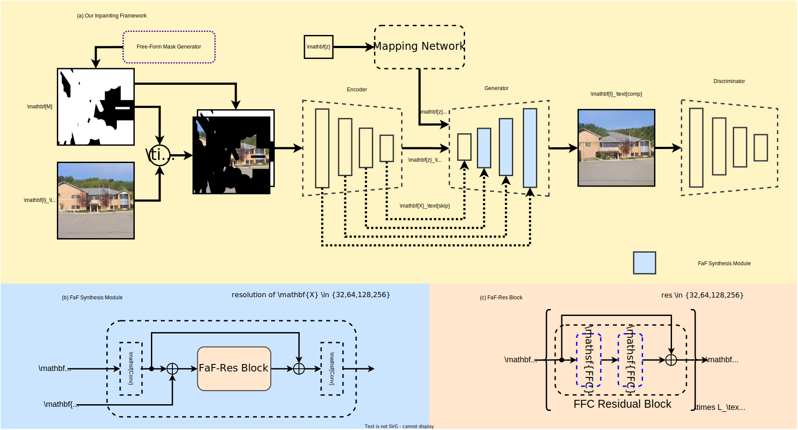

# FcF-Inpainting

[](https://pytorch.org/) [](https://opensource.org/licenses/Apache-2.0)

[Jitesh Jain](https://praeclarumjj3.github.io/), [Yuqian Zhou](https://yzhouas.github.io/), [Ning Yu](https://ningyu1991.github.io/), [Humphrey Shi](https://www.humphreyshi.com/home)
<!-- 
[[`arXiv`](https://arxiv.org/abs/2112.12782)] [[`pdf`](https://arxiv.org/pdf/2112.12782.pdf)] [[`BibTeX`](#3-citing-semask)] -->

This repo contains the code for our paper **Keys to Better Image Inpainting: Structure and Texture Go Hand in Hand**.



## Contents

1. [Setup Instructions](#1-setup-instructions)
2. [Dataset Preparation](#2-dataset-preparation)
3. [Training and Evaluation](#3-training-and-evaluation)
<!-- 4. [Citing FcF-Inpainting](#4-citing-fcf-inpainting) -->

## 1. Setup Instructions

- Clone the repo:

    ```.bash
    git clone https://github.com/SHI-Labs/FcF-Inpainting.git
    cd FcF-Inpainting
    ```

- Create a conda environment:

    ```.bash
    conda create --name fcfgan python=3.7
    conda activate fcfgan
    ```

- Install [Pytorch 1.7.1](https://pytorch.org/get-started/previous-versions/) and other dependencies:

    ```.bash
    pip3 install -r requirements.txt
    export TORCH_HOME=$(pwd) && export PYTHONPATH=.
    ```

- Download the models for the high receptive perceptual loss:

    ```.bash
    mkdir -p ade20k/ade20k-resnet50dilated-ppm_deepsup/
    wget -P ade20k/ade20k-resnet50dilated-ppm_deepsup/ http://sceneparsing.csail.mit.edu/model/pytorch/ade20k-resnet50dilated-ppm_deepsup/encoder_epoch_20.pth
    ```

## 2. Dataset Preparation

### CelebA-HQ Dataset

#### Training Data

- Download data256x256.zip from [gdrive](https://drive.google.com/drive/folders/11Vz0fqHS2rXDb5pprgTjpD7S2BAJhi1P).

    ```.bash
    mkdir -p datasets/
    # unzip & split into train/test/visualization
    sh tools/celebahq_dataset_prepare.sh

    datasets
    ├── celeba-hq-dataset
    │   ├── train_256
    │   ├── val_source_256
    │   ├── visual_test_source_256
    ```

#### Evaluation Data

- Generate 2k `(image, mask)` pairs to be used for evaluation.

    ```.bash
    bash tools/prepare_celebahq_evaluation.sh
    ```

### Places2 Dataset

#### Training Data

- Download the **Places2** dataset:

    ```.bash
    mkdir -p datasets/
    mkdir datasets/places2_dataset/
    wget http://data.csail.mit.edu/places/places365/train_large_places365challenge.tar
    tar -xvf train_large_places365standard.tar -C datasets/places2_dataset/
    mv datasets/places2_datasets/data_large datasets/places2_dataset/train
    
    wget http://data.csail.mit.edu/places/places365/val_large.tar
    tar -xvf val_large.tar -C datasets/places2_dataset/
    mv datasets/places2_dataset/val_large datasets/places2_dataset/val

    datasets
    ├── places2_dataset
    │   ├── train
    │   ├── val
    ```

- Generate 10k `(image, mask)` pairs to be used for validation during training.

    ```.bash
    bash tools/prepare_places_val.sh
    ```

#### Evaluation Data

##### Irregular Mask Strategy

- Generate 30k `(image, mask)` pairs to be used for evaluation.

    ```.bash
    bash tools/prepare_places_evaluation.sh
    ```

##### Segmentation Mask strategy

- Install [Detectron2-v0.5](https://github.com/facebookresearch/detectron2/releases/tag/v0.5).

    ```.bash
    python -m pip install detectron2==0.5 -f \
    https://dl.fbaipublicfiles.com/detectron2/wheels/cu110/torch1.7/index.html
    ```

- Download networks for segmentation masks:

    ```.bash
    mkdir -p ade20k/ade20k-resnet50dilated-ppm_deepsup/
    wget -P ade20k/ade20k-resnet50dilated-ppm_deepsup/ http://sceneparsing.csail.mit.edu/model/pytorch/ade20k-resnet50dilated-ppm_deepsup/encoder_epoch_20.pth
    wget -P ade20k/ade20k-resnet50dilated-ppm_deepsup/ http://sceneparsing.csail.mit.edu/model/pytorch/ade20k-resnet50dilated-ppm_deepsup/decoder_epoch_20.pth
    ```

- Generate `(image, mask)` pairs to be used for segmentation mask based evaluation.

    ```.bash
    bash tools/prepare_places_segm_evaluation.sh
    ```

> Note: The pairs are only generated for images with detected instances.

## 3. Training and Evaluation


### Training on 256x256

- Execute the following command to start training for 25M images on 8 gpus with 16 images per gpu:

    ```.bash
    python train.py \
        --outdir=training-runs-inp \
        --img_data=datasets/places2_dataset/train \
        --gpus 8 \
        --kimg 25000 \
        --gamma 10 \
        --aug 'noaug' \
        --metrics True \
        --eval_img_data datasets/places2_dataset/evaluation/random_segm_256
        --batch 128
    ```

> Note: If the process hangs on `Setting up PyTorch plugin ...`, refer to [this issue](https://github.com/NVlabs/stylegan2-ada-pytorch/issues/41).

### Evaluation

#### Pretrained Models

| **checkpoint** | **Description** |
|:--------------:|:---------------:|
| [places.pkl](https://drive.google.com/file/d/1U5P4KGSaQ6WdBuOMzElSlC-BI_gvTVPd/view?usp=sharing) | Model trained on 256x256 for 25M Places2 images |
| [celeba-hq.pkl](https://drive.google.com/file/d/17ljpuabSHOnxGZU_22T0Z2ztWkOLTqJt/view?usp=sharing) | Model trained on 128x128 for 25M CelebA-HQ images |

- Run the following command to calculate the metric scores (fid, ssim and lpips) using 8 gpus:

    ```.bash
    python evaluate.py \
        --img_data=datasets/places2_dataset/evaluation/random_segm_256 \
        --network=[path-to-checkpoint] \
        --num_gpus=8
    ```


#### Demo

- Run the following command and find the results in the `visualizations/` folder:

    ```.bash
    python demo.py \
    --img_data=datasets/demo/places2 \
    --network=[path-to-checkpoint]
    ```

<!-- ## 4. Citing FcF-Inpainting

```BibTeX
@article{jain2022keys,
  title={Keys to Better Image Inpainting: Structure and Texture Go Hand in Hand},
  author={Jitesh Jain and Yuqian Zhou and Ning Yu and Humphrey Shi},
  journal={arXiv},
  year={2022}
} -->
<!-- ``` -->

## Acknowledgement

Code is heavily based on the following repositories: [stylegan2-ada-pytorch](https://github.com/NVlabs/stylegan2-ada-pytorch/) and [lama](https://github.com/saic-mdal/lama).
