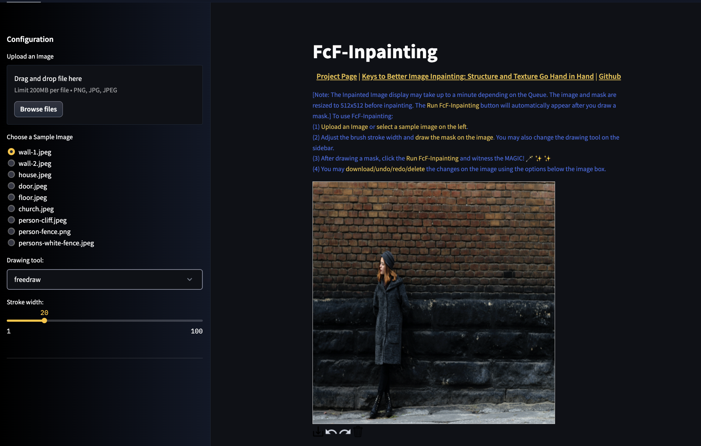

# Streamlit Demo

We provide the code for hosting an interactive streamlit demo for using FcF-Inpainting.

- Setup the conda environment: `sh setup.sh`.

- Download the [`places_512.pkl`](https://drive.google.com/file/d/1-44Esd02ReZwFNGq6_epjQ4s-2P6iUdL/view?usp=sharing)̌ model and place it into `models` directory.

- Execute `streamlit run app.py`. You will be able to access the demo through a url.

